# ClickCart


ClickCart is a comprehensive eCommerce platform built with Flutter, Node.js, and MongoDB, offering a seamless shopping experience and efficient admin management.

## Table of Contents
- [About](#about)
- [Built With](#built-with)
- [Features](#features)
- [Architecture](#architecture)
- [API Used](#api-used)
- [Requirements](#requirements)
- [Getting Started](#getting-started)
- [Configuration](#configuration)
- [Testing](#testing)
- [Screenshots](#screenshots)
- [Contributing](#contributing)
- [License](#license)
- [Contact](#contact)
- [Acknowledgments](#acknowledgments)

## About

ClickCart is designed to provide users with an intuitive shopping experience while offering administrators powerful tools for managing products, orders, and customer data.

## Built With

- **Frontend**: Flutter
- **Backend**: Node.js, Express.js
- **Database**: MongoDB
- **State Management**: Provider (Flutter)

## Features

### User Experience
- Seamless user authentication with email and social login integration
- Comprehensive product catalog with intuitive search and advanced filtering options
- Dynamic, real-time shopping cart functionality
- Secure, multi-option checkout process
- Detailed order tracking and history for users

### Admin Capabilities
- Robust admin panel for efficient inventory management
- Streamlined order processing and fulfillment
- In-depth analytics and reporting tools

### Enhanced Functionality
- Cross-platform push notifications for order updates and promotional campaigns
- Integrated payment processing:
  - Secure credit card transactions via Stripe
  - Cryptocurrency payments supported through Coinbase Commerce

### Security and Performance
- End-to-end encryption for all sensitive data
- Optimized for fast loading and smooth performance across devices

## Architecture

ClickCart follows a client-server architecture:
- Flutter apps (client and admin) communicate with the backend via RESTful APIs
- Node.js server handles business logic and database operations
- MongoDB stores product, user, and order data

## API Used

- Custom RESTful API built with Node.js and Express.js
- Stripe API for secure credit card processing
- Coinbase Commerce API for cryptocurrency payments 
- OneSignal for cross-platform push notifications

## Requirements

- Flutter SDK (version 2.5 or higher)
- Node.js (version 14 or higher)
- MongoDB (version 4.4 or higher)
- Android Studio/Xcode for mobile development

## Getting Started

### Installation

1. Clone the repository:
    ```bash
    git clone https://github.com/BenMishael/clickcart.git
    ```

2. Navigate to the project directory:
    ```bash
    cd clickcart
    ```

3. Install the dependencies for the backend:
    ```bash
    cd server_side/online_store_api
    npm install
    ```

4. Start the backend server:
    ```bash
    node index
    ```

5. Install the dependencies for the Flutter client app:
    ```bash
    cd ../../clickcart_client_app
    flutter pub get
    ```

6. Run the Flutter client app:
    ```bash
    flutter run
    ```

7. Install the dependencies for the Flutter admin panel:
    ```bash
    cd ../clickcart_admin_panel
    flutter pub get
    ```

8. Run the Flutter admin panel:
    ```bash
    flutter run
    ```

## Configuration

1. Create a `.env` file in the `server_side/online_store_api` directory
2. Add the following environment variables:
   ```
   MONGO_URL=your_mongodb_connection_string
   STRIPE_SECRET_KEY=your_stripe_secret_key
   COINBASE_API_KEY=your_coinbase_api_key
   ONESIGNAL_APP_ID=your_onesignal_app_id
   ```
3. Update the API base URL in the Flutter apps if necessary

## Testing

1. Run backend tests:
   ```bash
   cd server_side/online_store_api
   npm test
   ```
2. Run Flutter tests:
   ```bash
   cd clickcart_client_app
   flutter test
   ```

## Video
Check out our demo video to see ClickCart in action:


https://github.com/user-attachments/assets/e860b106-0eec-4b38-b2e3-0fdb86a8857d.mp4


## Screenshots
| Admin Panel | MongoDB Compass | Mobile App |
|:-----------:|:---------------:|:----------:|
| 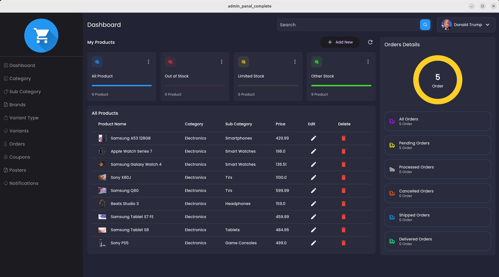 | 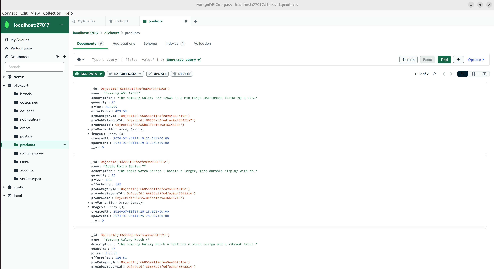 | 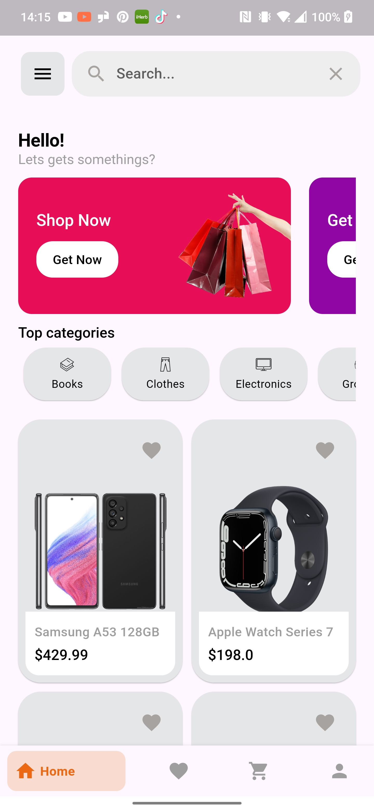 |
| 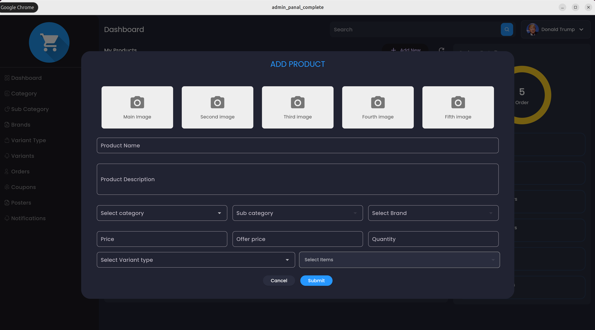 | 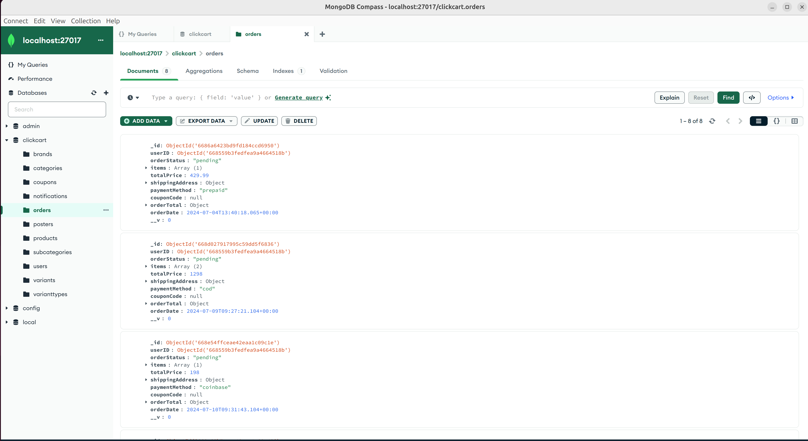 | 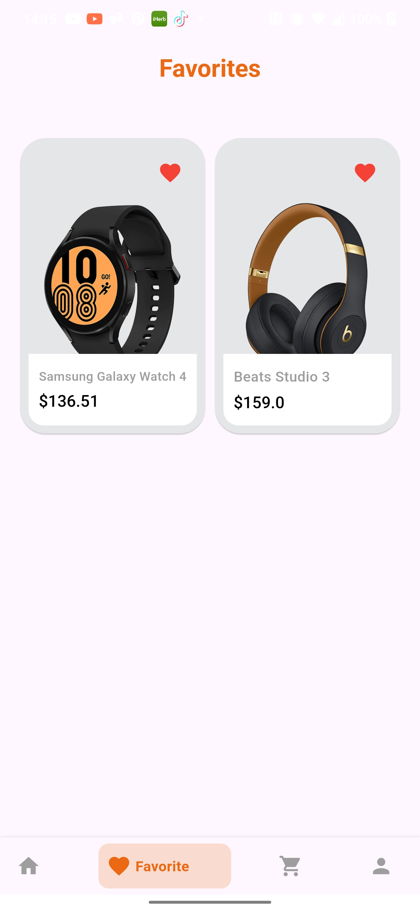 |
| 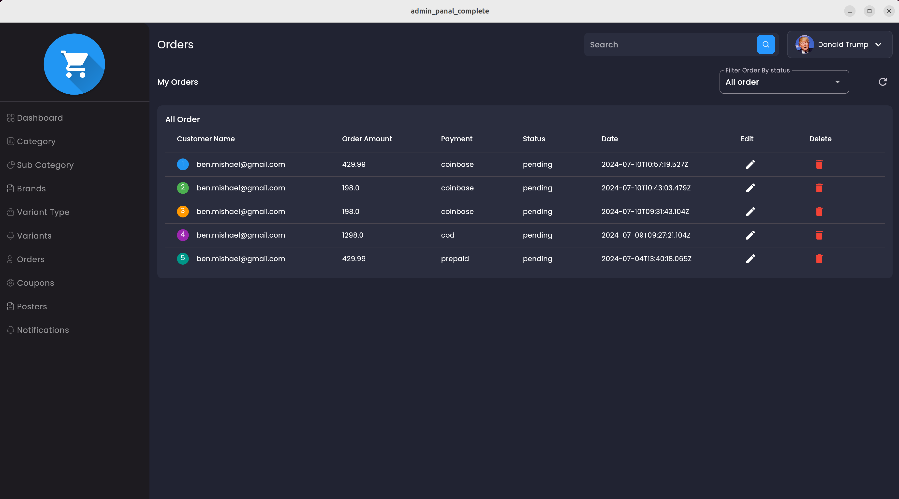 | 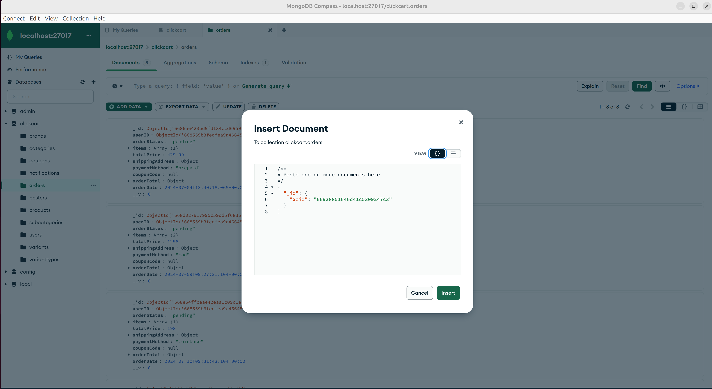 | 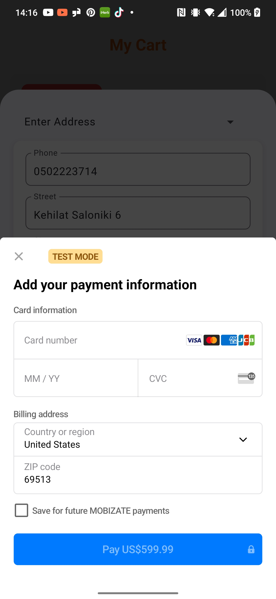 |
| 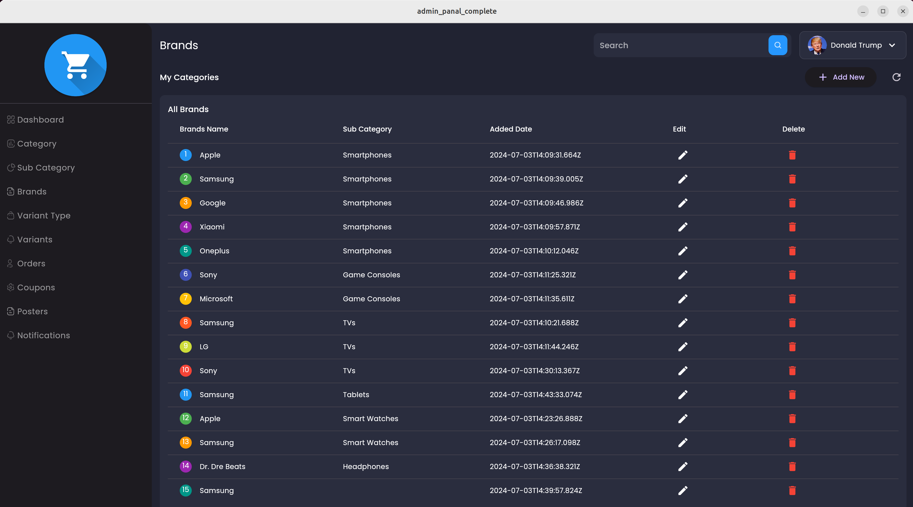 | 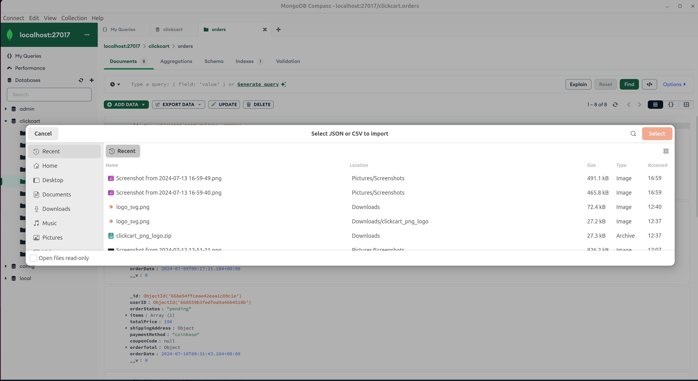 | 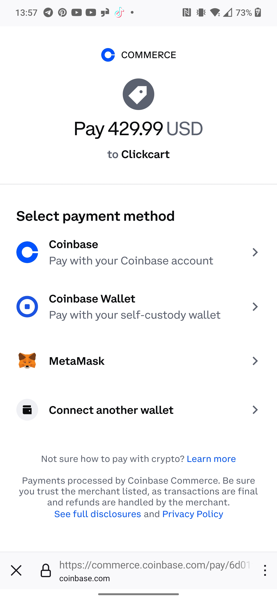 |

## Contributing

We welcome contributions to ClickCart! Please follow these steps:

1. Fork the repository
2. Create a new branch: `git checkout -b feature/your-feature-name`
3. Make your changes and commit them: `git commit -m 'Add some feature'`
4. Push to the branch: `git push origin feature/your-feature-name`
5. Submit a pull request

Please ensure your code adheres to our coding standards and includes appropriate tests.

## License

This project is licensed under the [MIT License](LICENSE).

## Contact

For any questions or concerns, please open an issue or contact the maintainers:
- [Ben Mishael](mailto:ben.mishael@gmail.com)
- [Yuval Zaltsman](mailto:zalts110@gmail.com)

## Acknowledgments

- Thanks to the Flutter, Node.js, and MongoDB communities for their excellent tools and support.

